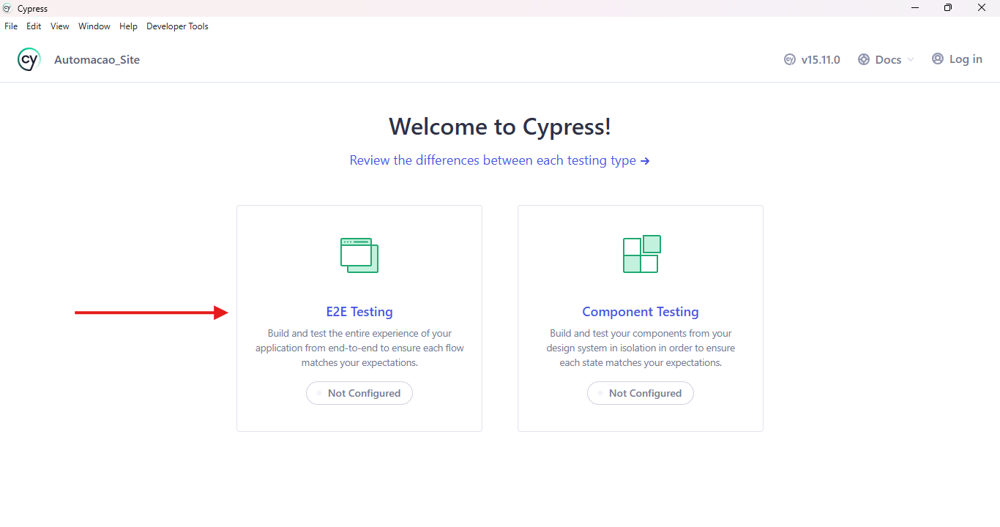
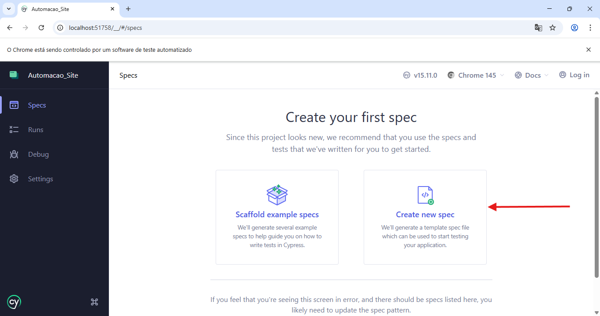
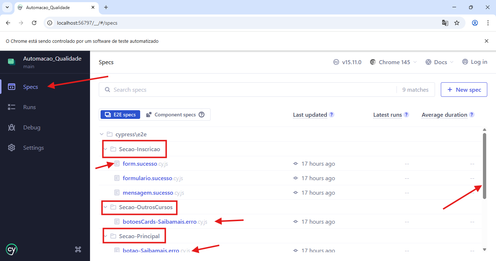
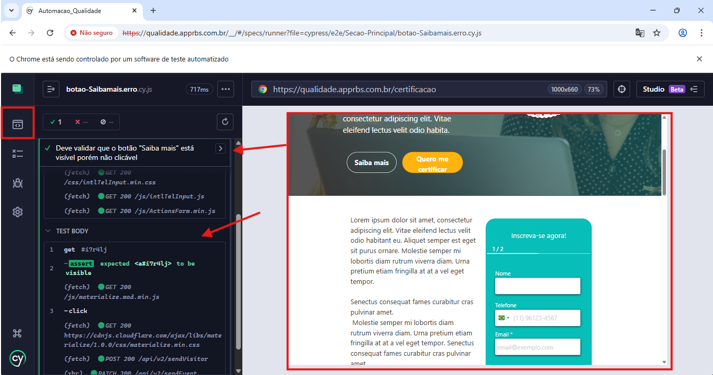

🚀 Automação de Testes - Faculdade Exemplo (Rubeus)
Este projeto consiste em uma suíte de testes ponta a ponta (E2E) utilizando Cypress para validar a funcionalidade, a navegação e a experiência do usuário no site de captação da Faculdade Exemplo. O projeto foca em boas práticas de Qualidade de Software, mapeando tanto fluxos de sucesso (Caminho Feliz) quanto o tratamento de erros e bugs visuais (Caminho Triste).

🛠️ Tecnologias e Dependências
Cypress: Framework principal de automação ponta a ponta.

Mochawesome: Utilizado para gerar relatórios detalhados em HTML e JSON.

Evidências: Configurado para gravação automática de vídeos e captura de telas (screenshots) em caso de falhas.

📦 Instalação
Clone o repositório:

git clone https://github.com/Guigoun/Qualidade-Rubeus.git
Inicie o projeto Node (gera o package.json básico):

npm init -y
Instale as Dependências do Projeto:

npm install
Instale o Cypress:

npm install cypress --save-dev
Instale as dependências do Relatório (Mochawesome):

npm install --save-dev mochawesome mochawesome-merge mochawesome-report-generator

🖥️ Guia de Configuração da Interface (Passo a Passo)
Para quem for rodar a automação pela primeira vez na máquina, siga estas instruções visuais:

1. Iniciar o Cypress: Execute npx cypress open e selecione a opção E2E Testing.

2. Validar Arquivos de Suporte: O Cypress mostrará os arquivos de configuração criados. Clique em Continue.

3. Seleção de Navegador: Escolha o navegador de sua preferência (ex: Chrome) e clique em Start E2E Testing.

4. Criar Spec: Selecione Create new spec (caso queira criar um novo teste) ou navegue pela estrutura existente.

5. Definir o Caminho do Teste: Confirme o local do arquivo dentro da pasta cypress/e2e.

6. Execução Inicial: Com a spec adicionada, clique em Okay, run the spec para iniciar os testes.

7. Visualização dos testes: Após clicar em "Run the spec", o Cypress abrirá a janela que possui as pastas com os arquivos dos testes. Para executar um teste basta clicar em um arquivo.

8. Acompanhamento da Execução: Após selecionar um arquivo de teste, o Cypress abrirá a janela de execução. No lado esquerdo, você verá o Log de Comandos e, no lado direito, a Visualização em Tempo Real do site. Para executar outros testes, utilize a aba lateral esquerda com o ícone de specs.

📂 Organização dos Testes
A arquitetura do projeto foi estruturada de forma modular, separando os testes por componentes e seções da tela para facilitar a manutenção:

Rodapé: Validações de links institucionais, políticas e redirecionamentos no fim da página.

Secao-Formulario: Validações de regras de negócio, campos obrigatórios e mensagens de erro (caminhos de sucesso e falha) no formulário de inscrição.

Secao-Principal: Testes focados na navegação institucional superior, validação do carrossel (banner rotativo) e canais de atendimento.

Secao-ProximosEventos: Testes de interação com cards e botões da grade de eventos.

Secao-RedesSociaisFinal: Validação ágil de atributos (href e target) dos ícones sociais, garantindo redirecionamentos corretos sem sobrecarregar a rede.

📊 Relatórios e Evidências
Para rodar todos os testes em modo headless (segundo plano) e gerar os relatórios e vídeos automaticamente, utilize o comando:

Bash
npx cypress run
Relatórios: Verifique a pasta reports/.

Vídeos e Screenshots: As gravações .mp4 ficam na pasta videos/ e as telas de falha em screenshots/.

Git: Pastas pesadas (node_modules/, reports/, videos/) estão devidamente configuradas no .gitignore para não sobrecarregar o repositório.

🐛 Bugs Identificados Durante a Automação
Como parte do processo de Quality Assurance (QA), a automação não apenas valida o funcionamento esperado, mas também serve como documentação de defeitos ativos em produção. Os seguintes problemas foram mapeados:

Falso Botão no Banner Rotativo (Acessibilidade/UX): O botão visual "INSCREVA-SE" no carrossel principal da Home é apenas uma imagem rasterizada estática. Não existe uma tag de hiperlink (<a>) envolvendo o elemento, impedindo o clique do usuário e prejudicando a acessibilidade para leitores de tela. Teste automatizado configurado para falhar intencionalmente como evidência desse bug.

Redirecionamento Incorreto de Canal de Atendimento: O link principal de "Atendimento" no menu superior, que deveria direcionar o usuário para uma central telefônica (via protocolo tel:) ou página de SAC, está redirecionando indevidamente para o WhatsApp, duplicando a função do botão vizinho.

Exceções de Console (Uncaught Exceptions): Scripts da aplicação lançam erros não tratados no navegador durante navegações e redirecionamentos externos (ex: TypeError: Cannot read properties of null (reading 'postMessage') e falhas de cálculo de atributos), indicando fragilidade no carregamento assíncrono de bibliotecas de terceiros.